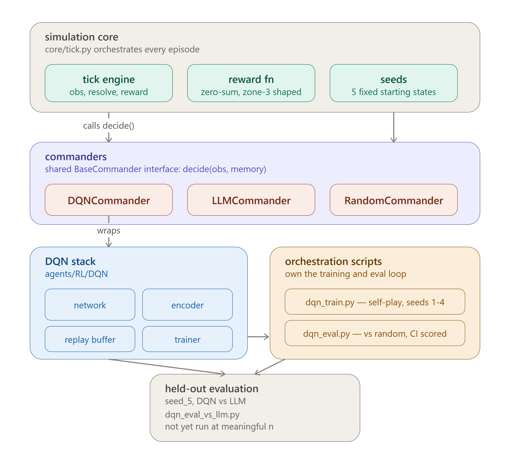
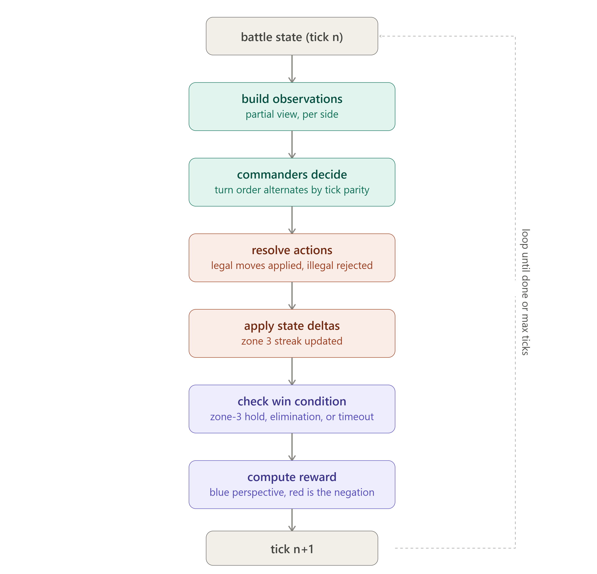
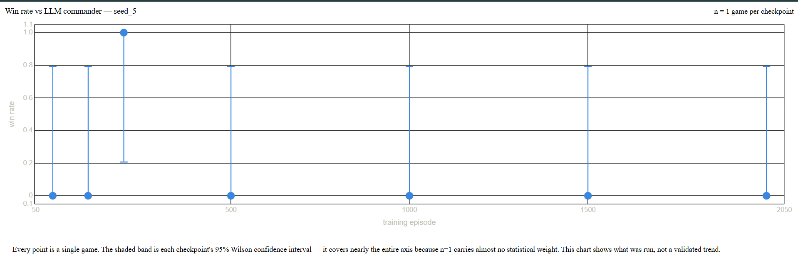

# ARES

A 5-zone tactical battle simulator built to train and evaluate reinforcement learning agents. Two commanders, Blue and Red, fight over a linear chain of zones by moving units and holding ground. ARES started as a testbed for LLM-driven commanders and evolved into a DQN self-play project once the LLM approach hit clear ceilings on tactical consistency.

This README documents what was built, what was verified, and what was not. Numbers that aren't backed by a real evaluation run are not included.

## What this is

A discrete-tick battlefield simulation with five zones in a line (1 through 5), each adjacent to its neighbors. Two sides start with units concentrated on opposite flanks and fight toward the center. Zone 3 is the contested middle ground: holding it for six consecutive ticks wins the game outright. The other way to win is elimination — reduce the enemy to zero units anywhere on the board. If neither happens, the game times out.

Every tick, both commanders receive a partial observation of the battlefield (their own units, remembered enemy positions from last contact, legal moves), decide independently, and their actions resolve simultaneously. Turn order alternates by tick parity so neither side gets a structural first-mover advantage over a full episode.

## Architecture

**Simulation core** (`ares-sim/core/`) — the tick engine (`tick.py`) is the orchestrator: it builds observations, collects both commanders' decisions, resolves actions into state deltas, applies them, checks win conditions, and computes reward. It's commander-agnostic — it doesn't know or care whether it's driving an LLM, a DQN network, or a random baseline, which is what let the project pivot from LLM commanders to RL without touching the simulator.

**Commanders** (`ares-sim/agents/Commander/`) — all implement a shared `BaseCommander` interface (`decide(obs, memory) -> CommanderDecision`):
- `DQNCommander` — wraps a trained `DQNNetwork`, decodes per-zone Q-values into hold/move actions, epsilon-greedy during training
- `LLMCommander` — Groq-backed commander via litellm, structured JSON output, rate-limited client-side (2 requests/min, 1000/day) to stay under provider limits
- `RandomCommander` — legal-move baseline for early DQN evaluation
- `QMIXCommander` — stub for the planned multi-agent extension, not implemented

**DQN stack** (`ares-sim/agents/RL/DQN/`):
- `network.py` — shared two-layer encoder feeding five independent zone heads (one Linear layer per zone). Each head outputs Q-values sized `1 (hold) + len(adjacent zones)`, so the action space per zone is small and structurally tied to the map's adjacency graph rather than a flat action space.
- `trainer.py` — Double DQN (online net selects the next action, target net evaluates it), Huber loss per zone summed into a single backward pass, gradient clipping at norm 10, target network synced every 100 steps.
- `replay_buffer.py` — plain FIFO deque, capacity 50,000, uniform sampling. No prioritization.
- `utils.py` (`compute_reward`) — zero-sum, computed from Blue's perspective and negated for Red. Terminal reward is ±10 on a win/loss. Non-terminal reward shapes toward zone-3 control: +1 for extending a Blue-held zone-3 streak, -1 for extending a Red-held one, and a streak-break penalty/bonus scaled by how long the streak had run before it broke.

**Training loop** (`scripts/dqn_train.py`) — single self-play run: one shared online network plays both sides, each tick's transitions from both Blue and Red get pushed into the same replay buffer, and the network trains after every simulated tick. Seed is chosen at random from a pool at the start of each episode. Checkpoints are saved at episodes 1500 and 2000.

## What was actually run

The DQN was trained via self-play for 2000 episodes against a pool of four hand-authored starting configurations (`seed_1` through `seed_4` in `config/seeds.py`) — varying flank strength, whether zone 3 starts contested, and asymmetric fuel/resource pressure. A fifth seed (`seed_5`, "mixed pressure with contested center and uneven flanks") exists in the same file and is explicitly documented as the intended held-out test for generalization against the LLM commander. It is not part of the training pool — `dqn_train.py` imports only `get_seed_1` through `get_seed_4`. This was intentional as a held-out set, but it was never used for a statistically meaningful evaluation, which is the open gap below.

Two evaluation harnesses exist:

- `dqn_eval.py` evaluates a checkpoint against `RandomCommander` across the four training seeds, with a proper Wilson confidence interval and configurable episode count per seed. This is the harness that produced the earlier reported 96% self-play win rate figures during development.
- `dqn_eval_vs_llm.py` evaluates a checkpoint against `LLMCommander` on `seed_5` specifically — the actual generalization test.

The `dqn_eval_vs_llm.py` run that exists in this repo (`results/dqn_vs_llm_seed5_results.json`) is not usable as evidence of anything. Two problems, both in the harness itself, not the model:

1. `n_episodes` is hardcoded to `1` in `main()`. Every checkpoint's reported win rate is a single game. The Wilson confidence interval on a single trial spans roughly 0 to 0.8, which is another way of saying the number carries almost no information.
2. The per-episode tick cap is set to 10 (`while not engine.done and ticks < 10`). The win condition requires six consecutive ticks of uncontested zone-3 control — meaning a game has to reach zone 3, take it, and hold it for six straight ticks, all within a 10-tick window, or it times out by construction. Most of the recorded results were timeouts. That is very likely an artifact of the tick cap, not a reflection of either commander's tactical quality.

So: DQN vs LLM generalization on the held-out seed was set up correctly in concept, but was never run under conditions that could produce a real answer. That evaluation is unfinished, not failed.

## Results

## Known issues, unresolved

- **`--resume` default in `dqn_train.py`** defaults to `checkpoint_dqn_ep_500.pt` rather than `None`. Running the script without an explicit `--resume ''` silently continues training from an old checkpoint instead of starting fresh, which is the wrong default for a training entrypoint.
- **`dqn_eval_vs_llm.py` tick cap** (10) is very likely too low relative to the win condition (6-tick zone-3 hold) to produce meaningful outcomes. Needs to be raised to something closer to the training cap (1000) or the harness's own random-opponent eval cap (also 1000) before the numbers mean anything.
- **`dqn_eval_vs_llm.py` episode count** is hardcoded at 1. Needs to be parameterized and run at an n large enough for the Wilson interval to be informative — the same standard the random-opponent harness already meets.
- **Side-identity encoding**: both Blue and Red share one network during self-play, distinguished by an absolute side bit in the observation encoding. This is a known risk for asymmetric seeds — a network that's only ever seen "Blue starts strong on the left" may not transfer cleanly to a seed where the strong side is reversed. Untested against `seed_4`, which was specifically designed to probe this (mirrored flank strength).

## What wasn't built

- QMIX / multi-agent extension (`QMIXCommander` is a stub)
- Any evaluation of the model against seed_5 under corrected harness conditions
- Prioritized experience replay
- Any systematic hyperparameter sweep — the values in `dqn_train.py` (lr 1e-3, batch 32, gamma 0.99, sync every 100 steps) were set once and not tuned

## Why this stopped here

The simulator, reward function, and DQN training pipeline all work — self-play converges, gradients don't diverge (Huber loss + grad clipping + Double DQN were specifically needed to fix an earlier divergence issue), and the network learns a policy that beats a random baseline across the four training seeds with a statistically real sample size. That part is done and verified.

What's not done is the part that would actually prove the agent learned something general rather than a script for four specific starting positions: a correctly-run evaluation against the held-out seed and against a qualitatively different opponent (the LLM commander). The harness for that exists but has two concrete bugs — hardcoded n=1 and a tick cap that's almost certainly too short for the win condition to ever trigger — that were never fixed before the project was set aside.

If picked back up, the fix is small and specific: parameterize `n_episodes` in `dqn_eval_vs_llm.py`, raise the tick cap, rerun. Everything needed to do that already exists in the codebase.